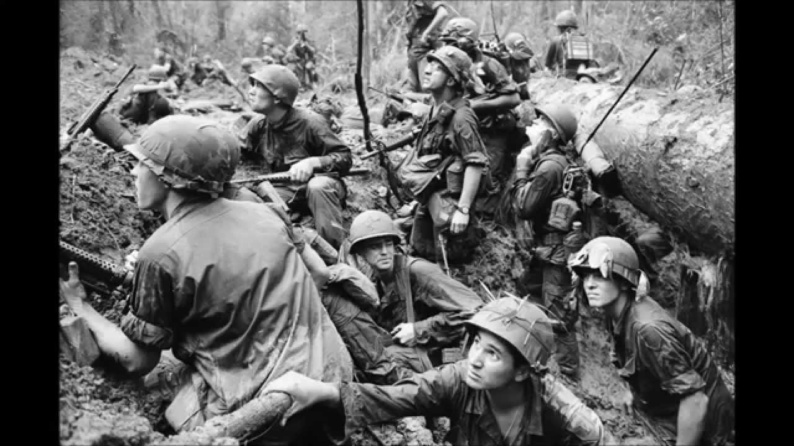

War Tactics
===========

Main reasons fighting in Vietnam was so difficult for Americans: 

* U.S. didn't know the land very well.

* Because Viet Cong hid in tunnels, Americans were vulnerable not knowing where
	the enemy was coming from.

* Bombs/Landmines were set everywhere.

* It was hard to identify the enemy because Viet Cong would blend in with
	Vietnamese civilians.

As said on the previous page, this war was far different than any the United 
States have been in before. All of the fighting took place in Vietnam, a giant 
jungle of a country, and U.S. troops did not know the lay of the land at all. 
This was a huge advantage for the Viet Cong, as they had underground tunnels
made, so they were never in sight, and when they were they came out of nowhere. 

The tactics of the Viet Cong were surprise attacks on U.S. troops with ambushes,
sabotage, raids, etc. This is known as guerilla warfare. It is a hit and run 
tactic that is used when fighting a larger, less mobile army. It worked 
incredibly well for the Viet Cong as U.S. men had no idea where they were
coming from or when they were coming.

Another thing that made fighting in Vietnam tough was that bombs and land mines
were set up all over when the Viet Cong knew the U.S. would be coming through,
and it resulted in many casualties as well as many people losing limbs.

One final thing that made it tough for the U.S. to fight in Vietnam was because
when they came to small towns and villages, the Viet Cong blended in with the
civilians, dressed in everyday clothes, and would even surprise attack from 
there. It was extremely difficult for any of the troops to identify the enemy
at any time.

