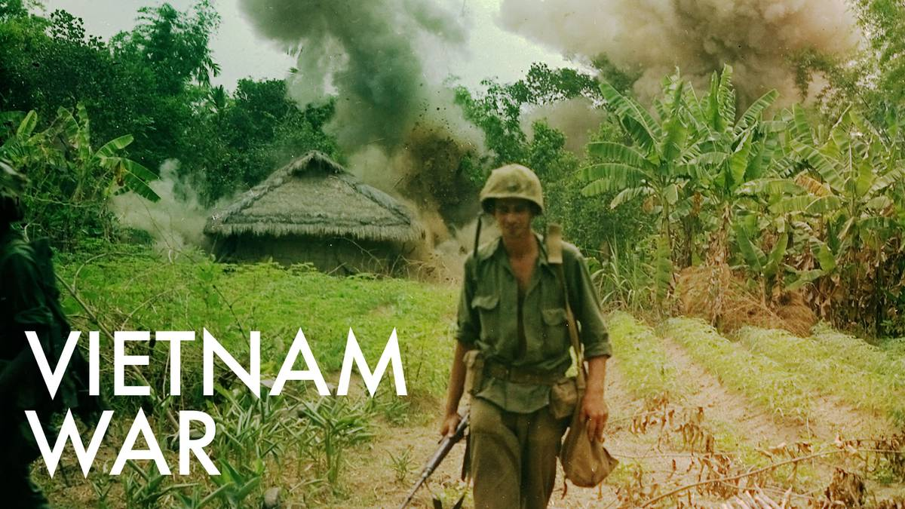

The Vietnam War
======================
1954-1975
---------

The Vietnam War was a long and hard conflict that emerged from the communist 
government of North Vietnam. Then U.S. President John F. Kennedy came up with 
the "Domino Theory," which held that if one Southeast Asian country fell to 
communism, many other countries would follow. 

The United States intervened in 1954 in fear of the Domino Theory as stated 
above. The Vietnamese Communists became known as the **Viet Cong**.
This war is much different than any the United States have been involved with
before due to all of the combat taking place on alien turf, leading to what is
called guerilla warfare. Also the use of chemical warfare, primarily Agent 
Orange, created concern for everyone. And the fact that this was the first war 
covered by the media in the United States created a lot of protesting all
throughout the nation once they were able to see everything that took place
where their loved ones were being sent.

During this war, more than 3 million people died, over half of that being 
innocent Vietnamese civilians, and includes over 58,000 American casualties.
In January of 1973 the U.S. and North Vietnam came to a final peace agreement, 
and the United Sates was officially out of the war.

================= ========  ==========
 Result           American  Vietnamese
================= ========  ==========
Killed            58,148    2 million
Wounded           304,000   3 million
Became Refugees   None      12 million
================= ========  ==========