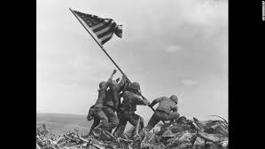

Start of World War II
=====================

There are many things that led to the start of World War II. Many people believe 
that it was no one thing that began the war, but a series of events. Some of 
these were when Japan seized Manchuria from China, Italy's invasion of 
Abyssinia, Adolf Hitler's re-militarization, and the Spanish Civil War. However, 
many people see Germany's attack on Poland as the main reason for the start of 
the war.

When it all Began
-----------------

World War II began on September 3rd, 1939, when the Prime Minister of Britain, 
Neville Chamberlain, declared war on Germany.

Countries Involved
~~~~~~~~~~~~~~~~~~

On July 7, 1937, something called the Marco Polo Bridge Incident led to a war
between Japan and China, and on September 1, 1939, when Germany invaded Poland 
Britain and France declared war on Germany in retaliation. This led other 
countries to also declare war like Russia, Italy, and the United States.

End of the War
~~~~~~~~~~~~~~

World War II ended with the surrender of the Axis powers. On May 8, 1945, the 
Allies accepted Germany's surrender about a week after Adolf Hitler committed 
suicide. While people were celebrating in Europe, there was still fighting going 
on in Japan. The atomic bombs dropped on Hiroshima and Nagasaki forced Japanese 
emperor to also surrender which officially marked the end of World War II.

