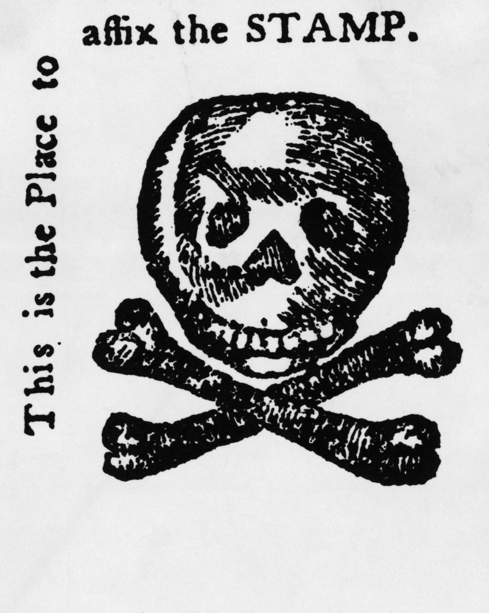

The Stamp Act and Taxation
==========================

There were many factors that were attributed to the start of the Revolutionary 
War in 1775, but one of them was the Stamp Act. Britain had just won the 
Seven Years' War against France and Spain, but this led to a major financhial 
crisis for the British. Their national debt skyrocketed, and the cost 
of government establishment quintupled. 

In an attempt to offset their massive amount of debt, Britain passed the Stamp
Act in 1765. This act placed a direct tax on the American Colonies, taxing not
only stamps, but other printed materials like newspapers, legal documents and
even playing cards. The Colonists believed that the tax was unfair, as they were
being taxed by a country that which they didn't have their own elected
representatives.

**Propaganda printed in opposition to the Stamp Act**

The Stamp Act was eventually repealed quickly in 1776, but it set a precedent
from the British to the Colonists, with the British claiming that they had the
right to pass laws that were detrimental to the Colonies if it meant they could
improve life in Britain. From 1767 onward, the British passed laws that raised
salaries for civil servants, but this increased opposition of the British among
the Colonists.