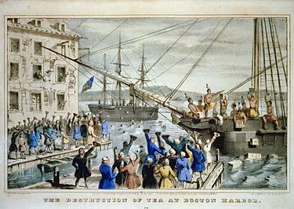

The Boston Tea Party
~~~~~~~~~~~~~~~~~~~~

When British soldiers occupied Boston in 1770, resentment between the Colonists
and British increased significantly when they opened fire on civilians in an act
now known as the Boston Massacre. The backlash was enough for Parliament to
repeal almost all taxes on the Colonists in an attempt to save face.

The British passed the Tea Act in 1773, which taxed the Colonists on tea. The
actions that followed this act were met with fierce opposition from the 
Colonists. On December 16, 1773, a Colonial resistance group boarded many
British ships in Boston Harbor and threw their entire supply of tea into the
water.

**"The Destruction of Tea at Boston Harbor"**

In response, Parliament passed legislation, referred to as the "Intolerable
Acts", that were meant to undermine the local democracy in the Colonies. The
Colonists believed that these laws undermined their natural rights and their
rights as Englishmen, which increased support of the American Patriots, 
Colonists that rebelled against the British and wanted Independence.