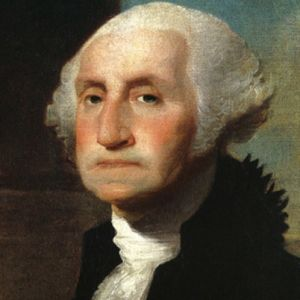

The Declaration of Independence
===============================

In 1775, tension between the Colonists and the British increased to its
breaking point. After further Colonial resistance of legislation from the 
British, the Battles of Lexington and Concord began on April 19, 1775. These
battles marked the first military engagements between the opposing groups.
The Continental Army was established by Congress on June 14. George Washington 
took control of the Army on July 3, and was the commander-in-chief throughout 
the duration of the war.

**George Washington**

Battle continued throughout the months, and on July 5, 1775, Congress attempted
to avert all-out war one final time, but was rejected by Parliament on August 
23. These actions only increased British resentment in the Colonies, and made 
the Colonists even more determined to become indepdent.

The first few months of battle were heavily favored by the Colonists, because
of the weak initial response of the war from the British, and the Colonists
gained the majority of control in every colony. Eventually, the British began
sending massive troops after a year of war, more than they've ever sent for
any war before then.

At this time, public support of independence in the Colonies has boosted
significantly. On July 2, Congress voted in favor of independence in a landslide
12-1 victory. Two days later on July 4, 1776, Congress issued its Declaration
of Independence. The Patriots then passed the Test Acts in an attempt to find
those who were neutral or against independence, requiring Colonists to pledge 
allegiance to the state they lived in. Failing to do so would result in 
imprisonment or death. Congress then allowed states to confiscate the property
of individuals who opposed independence in order to fund the war.